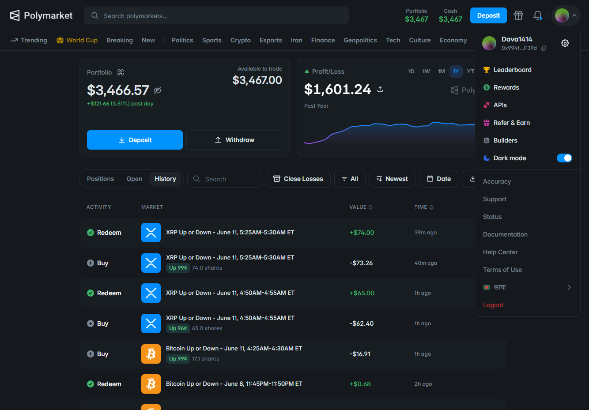

# Polymarket Spike Bot

> ## ⚠️ Public demo version — not the production bot
>
> **This repository is the version shared for selling / demonstration.** It does **not** include the real production settings used on the live account, including:
>
> - **Strike time**
> - **Entry point**
> - **Momentum variables**
>
> The constants in this repo are illustrative. Results on [@antsaslyku](https://polymarket.com/@antsaslyku) come from the **full, tuned configuration** — not from this public copy alone.
>
> **Want the complete bot or to collaborate?** Contact on Telegram:
>
> ### [**t.me/antsaslyku**](https://t.me/antsaslyku)

**Repository:** [github.com/ale2348/spike-bot](https://github.com/ale2348/spike-bot) · **Author:** [@ale2348](https://github.com/ale2348)

A **Rust** bot for **Polymarket 5-minute crypto Up/Down** markets — **BTC, ETH, SOL, and XRP**. It watches **Binance** spot prices for momentum, then places a **limit buy** on the matching Polymarket Up or Down token at the **current ask**, holds through resolution, and tracks P/L.

**Live profile using this strategy family:** [**@antsaslyku on Polymarket**](https://polymarket.com/@antsaslyku)

The bot connects to Polymarket Gamma + CLOB APIs, streams live order-book prices, and can run in **simulation mode** (no real orders) or **live mode** with your wallet. Press **Ctrl+C** to stop.

---

## Live proof — buy → redeem cycles

These are real on-chain transactions from [@antsaslyku](https://polymarket.com/@antsaslyku) on Polygon. Each pair shows the same pattern the bot follows: **buy the favorite late in the window → redeem at $1.00 after resolution**.

### Trade 1 — Jun 11, 2026 · ~$0.99 entry

| Step | Time (UTC) | Details | Polygonscan |
|------|------------|---------|-------------|
| **Buy** | 09:30:01 | ~**$67.32** USDC → **68 shares** @ **~$0.99** (late-window favorite) | [View buy tx](https://polygonscan.com/tx/0x6874a18bcd84c18a6e9d5cffd0a94eb0bdc148089a364370eb9120384bc4e21c) |
| **Redeem** | 09:31:03 | Market resolves → shares redeemed for **~$1.00** each | [View redeem tx](https://polygonscan.com/tx/0x17e8fbc7ed8d995c44127da034e487733a43f18c6638cdcba9088a519b11ad63) |

**Approx. gross profit:** ~**$0.68** on ~$67 stake (~**1%**) before fees, in **~62 seconds**.

### Trade 2 — Jun 11, 2026 · ~$0.99 entry

| Step | Time (UTC) | Details | Polygonscan |
|------|------------|---------|-------------|
| **Buy** | 08:55:01 | Buy favorite @ **~$0.98–$0.99** near window end | [View buy tx](https://polygonscan.com/tx/0x7fa58be45dc24afbc8bd135fc6a7147fb548e2c00ad2f5b6100fa7510dd58b45) |
| **Redeem** | 08:55:30 | Resolution redeem **~29s** after buy | [View redeem tx](https://polygonscan.com/tx/0x4edaaa3a6a6d854fe6ec938280ab3cfd34d07f34fcc75c7f4757feccfc9d30dc) |

> **How to read these txs:** The **buy** tx interacts with `Polymarket: CTF Exchange V2` — USDC out, outcome shares in. The **redeem** tx settles winning shares back to USDC at **$1.00** per share when the 5m window resolves. Repeat this across many windows and P/L compounds — see the full history on [polymarket.com/@antsaslyku](https://polymarket.com/@antsaslyku).

### Profile screenshots ([@antsaslyku](https://polymarket.com/@antsaslyku))

Live Polymarket dashboard — portfolio growth and buy/redeem activity on **BTC** and **XRP** 5m markets at **96–99¢**:



- Past year P/L: **+$82,537.48**
- Past day P/L: **+$208.04**
- 24h Return: **+3.51%**
- Portfolio Value: **~$3,467**

Trade history includes repeated entries in late-stage crypto prediction markets followed by successful redemptions at settlement.

---

## How it works

Each **5-minute Up/Down** market (BTC, ETH, SOL, XRP) runs for **300 seconds**. The bot streams **Binance** mid-prices and **Polymarket** best asks in real time.

```
Binance price move (lookback window)
        │
        ▼
  Up or Down signal?
        │
        ▼
Limit buy @ current Polymarket ask  ──►  cancel if unfilled after N seconds
        │
        ▼
Hold to resolution  ──►  redeem winning shares @ $1.00
```

1. **Subscribe** to Binance book-ticker feeds for configured symbols
2. **Detect momentum** — price moved up or down by a USD threshold within `lookback_secs`
3. **Buy Up** on upward momentum, **buy Down** on downward momentum
4. **Place a limit order** at the current Polymarket ask (skipped if ask > `max_ask_price`)
5. **Cancel** unfilled orders after `cancel_after_secs`
6. **Track fills and resolution** — wins pay ~$1/share; losses cost the entry notional

| | Typical win | Risk |
|---|-------------|------|
| **Math** | Buy @ ~$0.50–$0.98 → redeem @ **$1.00** if correct side wins | Wrong side → stake lost |
| **Edge** | Momentum + early entry before the crowd | Reversal or no fill → missed or losing trade |

---

## Configuration

Copy [`config.json.example`](config.json.example) to `config.json` and fill in your wallet details. **Never commit `config.json`** — it is gitignored and holds secrets.

```bash
# macOS / Linux
cp config.json.example config.json

# Windows
copy config.json.example config.json
```

Full schema and starter values are in [`config.json.example`](config.json.example). Key fields:

**`polymarket`**

| Field | Required | Description |
|-------|----------|-------------|
| `private_key` | Yes (live trading) | 64-character hex private key (with or without `0x`) |
| `proxy_wallet_address` | For email/social login | Polymarket profile address from account settings |
| `signature_type` | For proxy accounts | `0` EOA · `1` proxy · `2` Gnosis Safe (typical for Polymarket.com) |
| `gamma_api_url` / `clob_api_url` | No | API endpoints (defaults are fine) |

**`strategy`** — see the example file for all keys. Tune `momentum`, `trade_shares`, and timing fields to match your risk profile.

| Field | Purpose |
|-------|---------|
| `simulation_mode` | `true` = log only, no orders (start here) |
| `symbols` | Assets to monitor (`btc`, `eth`, `sol`, `xrp`) |
| `momentum.<symbol>` | USD move + lookback window per asset |
| `trade_shares` | Shares per limit order (minimum 5) |
| `max_ask_price` | Skip when Polymarket ask is above this |
| `cancel_after_secs` | Cancel unfilled limits after N seconds |
| `trades_log` / `performance_log` | Optional log file paths |

Many windows produce **no trade** — normal when momentum never crosses the threshold or the ask is too high.

**Wallet setup**

| Account type | What to set in `config.json` |
|--------------|------------------------------|
| MetaMask / hardware wallet | `private_key` only — omit or remove `proxy_wallet_address` |
| Polymarket.com (email / Google) | `private_key` + `proxy_wallet_address` + `signature_type: 2` |

---

## Requirements

- **Windows:** `poly-spike-bot.exe` (included) **or** build from source
- **Linux / macOS:** [Rust](https://rustup.rs/) (stable, 2021 edition) to compile
- Polymarket wallet with **USDC** on Polygon
- Internet access (Polymarket Gamma + CLOB APIs, Binance WebSocket)

---

## Quick start (Windows — `poly-spike-bot.exe`)

The repo ships a pre-built Windows binary: **`poly-spike-bot.exe`**. No Rust install needed.

### 1. Download or clone

```powershell
git clone https://github.com/ale2348/spike-bot.git
cd spike-bot
```

Or download the release / zip that contains `poly-spike-bot.exe`.

### 2. Create `config.json`

Place `config.json` in the **same folder** as `poly-spike-bot.exe`:

```powershell
copy config.json.example config.json
```

Edit `config.json` — set your `private_key` and, if using Polymarket.com login, your `proxy_wallet_address`. See [Configuration](#configuration) and [`config.json.example`](config.json.example).

### 3. Run the bot

Open **Command Prompt** or **PowerShell** in the folder with the exe:

```powershell
# Default config.json in current directory
.\poly-spike-bot.exe

# Custom config path
.\poly-spike-bot.exe --config C:\path\to\config.json

# Optional: verbose logs
$env:RUST_LOG="info"
.\poly-spike-bot.exe
```

Start with `"simulation_mode": true` to verify signals and logging without placing orders. Set `"simulation_mode": false` for live trading.

### 4. Redeem winning positions (Windows)

After markets resolve, redeem USDC from winning shares:

```powershell
# Redeem all redeemable positions for proxy_wallet_address
.\poly-spike-bot.exe --redeem

# Redeem a specific market condition
.\poly-spike-bot.exe --redeem --condition-id 0xYOUR_CONDITION_ID
```

`--redeem` requires `proxy_wallet_address` in `config.json`.

---

## Quick start (Linux / macOS — build from source)

### 1. Install Rust

```bash
curl --proto '=https' --tlsv1.2 -sSf https://sh.rustup.rs | sh
source "$HOME/.cargo/env"
rustc --version
```

### 2. Clone and build

```bash
git clone https://github.com/ale2348/spike-bot.git
cd spike-bot
cargo build --release
```

The release binary is:

```text
target/release/polymarket-bot-5m-market-binace-free-limit-fixed-shares
```

### 3. Configure and run

```bash
cp config.json.example config.json
# edit config.json with your wallet credentials
```

Then run:

```bash
RUST_LOG=info ./target/release/polymarket-bot-5m-market-binace-free-limit-fixed-shares

# Custom config
./target/release/polymarket-bot-5m-market-binace-free-limit-fixed-shares --config config.json

# Redeem
./target/release/polymarket-bot-5m-market-binace-free-limit-fixed-shares --redeem
```

### 4. Run with PM2 (optional, Linux server)

```bash
npm install -g pm2   # if PM2 is not installed
pm2 start ecosystem.config.js
pm2 logs
pm2 save
```

`ecosystem.config.js` points at the release binary under `target/release/`.

---

## CLI reference

| Flag | Description |
|------|-------------|
| `-c`, `--config <path>` | Config file (default: `config.json`) |
| `--redeem` | Redeem-only mode — no trading |
| `--condition-id <id>` | With `--redeem`, redeem one condition (hex, with or without `0x`) |

---

## Reading the logs

| Message | Meaning |
|---------|---------|
| `Momentum strategy started — symbols: [...]` | Bot running with configured assets |
| `🚀 SIGNAL BTC Up — $+60.00 in 15s` | Binance momentum crossed threshold |
| `Current Up ask: $0.52 — limit buy @ $0.52` | Placing limit at live ask |
| `⏭️ Skipping BTC Up — ask $0.99 above $0.98 max` | Ask too high — no order |
| `[SIM] LIMIT BUY Up BTC — 5 shares @ $0.52` | Simulation — no real order |
| `✅ FILL [LIVE] BTC Up — ask $0.52 <= limit $0.52` | Order filled |
| `❌ NO FILL BTC Up — last ask $0.55 > limit $0.52` | Not filled before cancel |
| `🗑️ Cancelled unfilled order ... after 5s` | Limit cancelled per config |
| `🏁 RESOLVED BTC Up — WIN PnL $+2.40` | Market settled — P/L updated |
| `⚠️ No private key provided. Bot can only monitor` | Missing `private_key` in config |

Optional log files:

- **`trades.log`** — buy / signal events (if `trades_log` is set)
- **`performance.log`** — fills, resolution, cumulative P/L (default)

---

## Risks & disclaimer

- **Momentum can reverse** — a filled order on the wrong side loses the entry cost.
- **Not every signal trades** — cooldown, max ask, missing liquidity, or one order per 5m window per market can skip entries.
- **Demo config ≠ production** — [@antsaslyku](https://polymarket.com/@antsaslyku) results use tuned parameters not shipped in this repo.
- **Not financial advice** — use at your own risk.

---

## Project layout

```
spike-bot/
├── poly-spike-bot.exe          # Pre-built Windows binary
├── config.json.example         # Config template (copy to config.json)
├── config.json                 # Your local config (gitignored — never commit)
├── ecosystem.config.js         # PM2 config for Linux servers
├── Cargo.toml                  # Rust package manifest
├── src/
│   ├── main.rs                 # Entry point, CLI, redeem mode
│   ├── config.rs               # config.json schema
│   ├── strategy.rs             # Binance momentum → limit buy logic
│   ├── binance.rs              # Binance price feed
│   ├── api.rs                  # Polymarket CLOB / redeem
│   └── ...
├── doc/                        # Screenshots (Polymarket profile P/L)
│   ├── daily_pnl.png
│   └── total_pnl.png
└── target/release/             # Built binary after `cargo build --release`
```

---

## License

This project is open source and available under the ISC License.